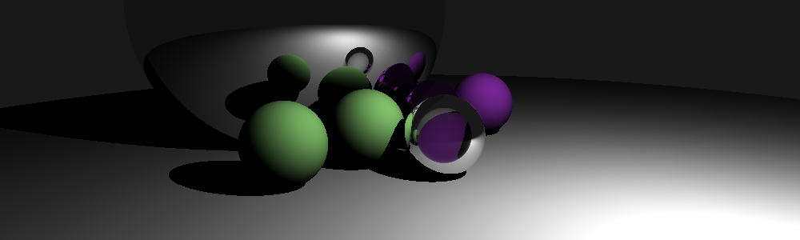

# What is this?

This is an opinionated implementation of a physically based raytracer, based on ["The PBR Book"](http://www.pbr-book.org/).

The architecture largely follows that in the book, with the following small departures:
 - I'm implementing this in a nonlinear order, tackling things that interest and excite me as I see fit
 - I've tried to remain true to idiomatic rust style, when appropriate
 - I've tried to choose variable and function names to be clearer

My main goals for this project:
 - Have fun working on areas of programming that I haven't been exposed to before!
   - I've done a lot in the web and distributed systems space, and very little in 3D graphics
 - Revel in the joy of working with the rust programming language!
   - My day job is in Java, and this serves as mild therapy for me :)
 - Create a log of my progress, and interesting bugs I've encountered.
   - If you're working on your own raytracer, my hope is that you can explore the commit history and learn something from my process.

Feel free to reach out to me on [Twitter](https://twitter.com/Quantumplation) if you have any questions, I *love* explaining things.