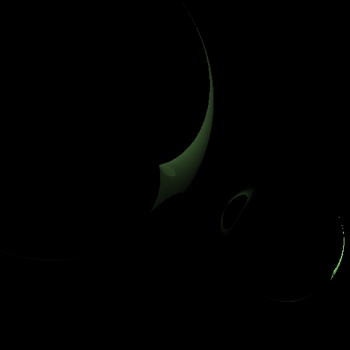
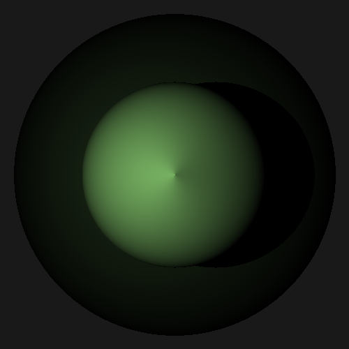
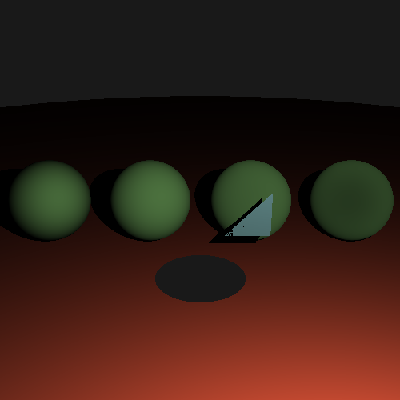
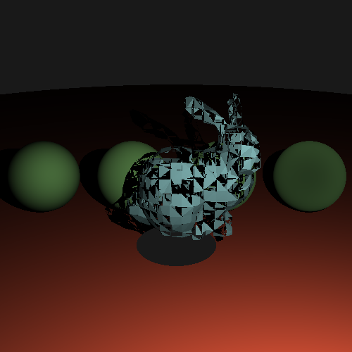

# Bugs

Similar to the progress folder, this folder documents interesting or entertaining bugs found during the development of the project.

## Index

|                           Image                            |       Date       |    Description                                                                      |
|------------------------------------------------------------|------------------|-------------------------------------------------------------------------------------|
|         | 2021-01-08T01:51 | A dark ring appears on the sphere, likely because of lack of visibility testing.
|     | 2021-01-09T02:47 | In an attempt to remove the dark ring, I added visibility testing, but there's still floating point error!
|         | 2021-01-20T19:39 | Adjusting the camera position even slightly creates a weird code effect where the sphere disappears.
|     | 2021-01-21T00:13 | After fixing the cone issue above, I now can't position spheres in any way
|    | 2021-01-21T00:13 | Occlusion testing is failing, meaning I'm not casting shadows properly.  The green is intentional, all points that are occluded.
|      | 2021-01-25T21:22 | While implementing fresnel/reflection models, lambertian reflection gives an odd result.
|| 2021-01-26T00:37 | There are odd singularities in sphere normals
|     | 2021-01-27T03:33 | There are odd collision testing issues with triangles.  Likely FP error for the occlusion ray
|          | 2021-01-28T04:11 | This weird eldritch horror came up when implementing bounding-volume-hierarchy aggregators