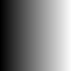
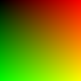

# Progress

This folder has screenshots of various milestones in the development of the development of this raytracer, so I can see how far I've come.

## Index

|                 Image                 |       Date       |    Description                                                                      |
|---------------------------------------|------------------|-------------------------------------------------------------------------------------|
|      | 2021-01-06T01:32 | The first image generated by the render loop, before we even have any actual raytraces
|| 2021-01-06T01:36 | A gradient in the x direction, to confirm we're writing meaningful data to the film
|      | 2021-01-06T02:11 | Added Spectrum color to the film and ray tracer, along with a sample gradient