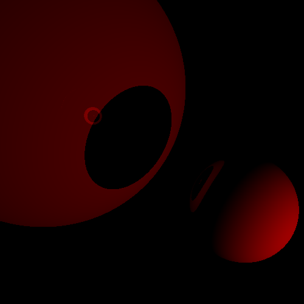
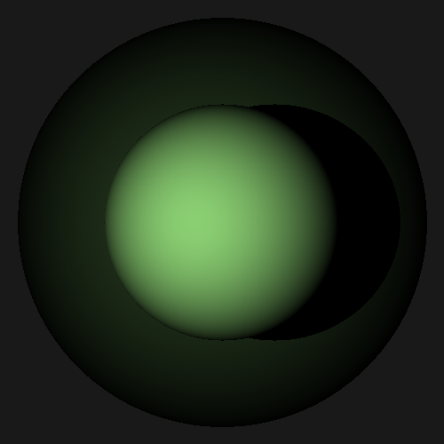
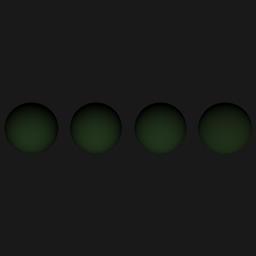
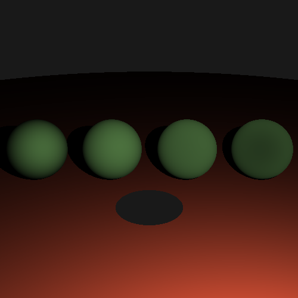
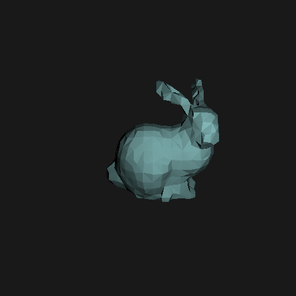
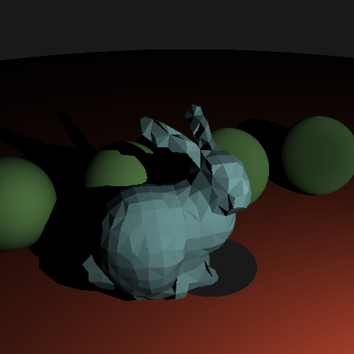
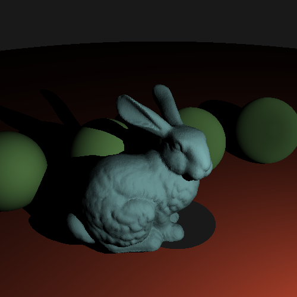
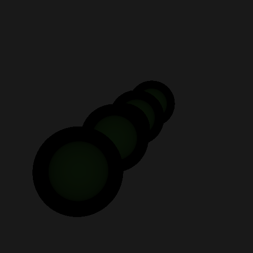
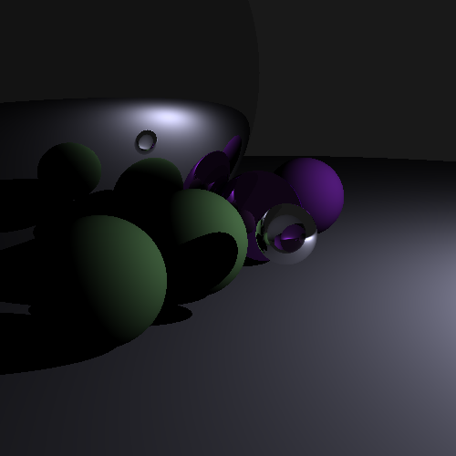

# Progress

This folder has screenshots of various milestones in the development of the development of this raytracer, so I can see how far I've come.

## Index

|                          Image                         |       Date       |    Description                                                                      |
|--------------------------------------------------------|------------------|-------------------------------------------------------------------------------------|
|     | 2021-01-06T01:32 | The first image generated by the render loop, before we even have any actual raytraces
|  | 2021-01-06T01:36 | A gradient in the x direction, to confirm we're writing meaningful data to the film
|     | 2021-01-06T02:11 | Added Spectrum color to the film and ray tracer, along with a sample gradient
|    | 2021-01-06T21:35 | Ray->Sphere intersections, along with tweaking the rays generated by the camera
|   | 2021-01-06T23:23 | Hacked in a simple shading method to test the sphere intersection normal calculation
|      | 2021-01-07T02:15 | Added a simple PrimitiveList shape for multiple objects, and implemented point lights
|       | 2021-01-15T02:35 | Implements camera transforms for a perspective camera correctly, so we can have field-of-view
|   | 2021-01-21T01:58 | After working through subtle transform bugs, occlusion is working, meaning we cast shadows!
| | 2021-01-21T01:58 | Specular reflection! Completely skips BSDFs / material properties
|     | 2021-01-26T00:43 | Implemented matte materials (angle 1)
|   | 2021-01-26T00:44 | Implemented matte materials (angle 2)
| | 2021-01-26T20:54 | Implemented Oren-nayar microfacet, to control roughness
|      | 2021-01-26T23:47 | Implemented disk collision
|    | 2021-01-27T19:18 | Triangle meshes, and the stanford bunny! (180+ seconds to render!)
|  | 2021-01-28T21:56 | Triangle meshes, now accelerated by a BVH! (4 seconds to render!)
|| 2021-01-28T22:48 | Full res bun.  47 seconds to render in release mode.
|| 2021-01-29T22:48 | First pass at pure transmission.  Things are really dark because I don't have lots of lights, and I'm not mixing it correctly.
| | 2021-01-30T00:55 | More materials!  Mirrors, Plastics, and Glass, oh my!